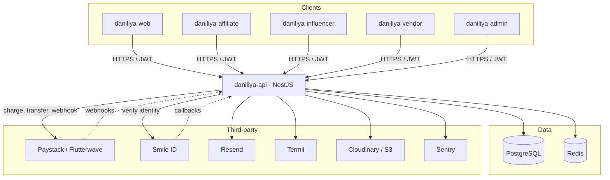
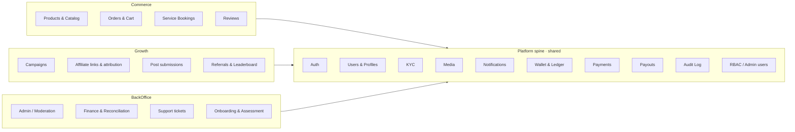

# Daniliya Platform — Backend Architecture

> Status: **Design (pre-implementation)** · Target API: `daniliya-api` (NestJS)
> This document is the system-level baseline. Data model, endpoints, and flows
> live in the sibling docs (see [README](./README.md)).

## 1. What Daniliya is

Daniliya is a Nigerian **commerce + services + creator-economy** platform with
one backend API serving five frontends:

| Surface | Repo | Audience | Core jobs |
|---|---|---|---|
| Public web / marketplace | `daniliya-web` | Shoppers, service clients, recruits | Browse & buy products, book services, apply to join |
| Affiliate portal | `daniliya-affiliate` | Affiliates | Share links, drive sales, get paid Monday |
| Influencer portal | `daniliya-influencer` | Creators | Run CPA campaigns, submit posts, earn per conversion |
| Vendor portal | `daniliya-vendor` | Sellers | List products, fulfil orders, get paid out |
| Admin portal | `daniliya-admin` | Staff | Moderate everyone & everything, run finance/payouts |

All five talk to **one API** (`daniliya-api`). There is no per-surface backend.

## 2. Technology (decided — from `daniliya-api/.env.example`)

| Concern | Choice | Env keys |
|---|---|---|
| Framework | **NestJS** (TypeScript) | — |
| Primary DB | **PostgreSQL** | `DATABASE_URL` |
| ORM / migrations | **Prisma 7** (`@prisma/adapter-pg`, config in `prisma.config.ts`) | — |
| Cache / queues / sessions | **Redis** | `REDIS_URL` |
| AuthN | **JWT** access + refresh | `JWT_ACCESS_SECRET`, `JWT_REFRESH_SECRET`, `*_EXPIRES_IN` |
| Field encryption | AES key | `ENCRYPTION_KEY` |
| Payments (collection) | **Paystack**, **Flutterwave** | `PAYSTACK_*`, `FLUTTERWAVE_*` |
| Payouts / transfers | Paystack/Flutterwave Transfers | (same keys) |
| Identity / KYC | **Smile ID** | `SMILE_ID_PARTNER_ID`, `SMILE_ID_API_KEY`, `SMILE_ID_ENVIRONMENT` |
| Transactional email | **Resend** | `RESEND_API_KEY`, `RESEND_FROM_*` |
| SMS / OTP | **Termii** | `TERMII_API_KEY`, `TERMII_SENDER_ID` |
| Media uploads | **Cloudinary** + **AWS S3** | `CLOUDINARY_*`, `AWS_*` |
| Error monitoring | **Sentry** | `SENTRY_DSN` |
| Bootstrap admin | — | `ADMIN_EMAIL` |

**Currency:** Nigerian Naira (₦). Store money as **`Decimal(12,2)`** (Postgres
`NUMERIC` — exact, not a float). Never cast to a JS `number` for arithmetic; use
`Prisma.Decimal`. Convert to kobo integers only at the payment-gateway boundary.
(Decided 2026-07-16; see [data model](./02-data-model.md).)

## 3. System context

## 4. Module map (NestJS)

The API is organized into feature modules. A shared "platform spine" is reused
by every role; role- and commerce-specific modules sit on top.

## 5. Actors & roles

- **Guest** — browse catalogue, track order by reference, apply to join.
- **Customer** — a registered buyer (may also hold another role).
- **Affiliate** — earns a **flat ₦10,000** per qualifying conversion; paid weekly (Monday).
- **Influencer** — earns **CPA** (per-conversion rate set by each campaign).
- **Vendor** — sells products; paid out net of platform take-rate.
- **Admin / Staff** — RBAC roles (e.g. `superadmin`, plus scoped roles via invite).

A single `User` can hold multiple roles; role-specific data lives in profile
tables (see the [ERD](./02-data-model.md)).

## 6. Cross-cutting conventions

- **AuthN:** short-lived JWT **access** token + rotating **refresh** token
  (stored server-side / Redis for revocation). OTP (email via Resend, SMS via
  Termii) for verification and sensitive actions.
- **AuthZ:** role + permission guards; every **money- or status-affecting write
  is audit-logged** (actor, entity, before/after, timestamp, IP).
- **Money:** `Decimal(12,2)` everywhere (via `Prisma.Decimal`); every balance
  change goes through the **double-entry ledger** — no ad-hoc balance mutation.
  Charges and transfers are **idempotent** (idempotency keys) because payment
  webhooks retry.
- **Idempotency:** all webhook handlers (Paystack, Flutterwave, Smile ID) and
  all payment/transfer creation endpoints are idempotent.
- **Async work:** Redis-backed queues (BullMQ) for emails, payout runs,
  attribution rollups, assessment scoring, media processing.
- **Validation:** DTOs validated with `class-validator`; reject unknown fields.
- **Pagination:** cursor or `?page&limit`; list endpoints return `{ data, meta }`.
- **Errors:** consistent problem shape `{ statusCode, code, message, details? }`.
- **Media:** clients request a signed upload target; the API stores only the
  resulting URL + metadata.
- **Multi-tenancy of data:** vendor/affiliate/influencer can only read/write
  their own records; enforced by ownership guards, not just UI.

## 7. Environments & deployment

- Config via env (`.env.example` is the contract). Secrets never committed.
- Dockerized (`Dockerfile`, `docker-compose.yml` present) — Postgres + Redis +
  API for local dev.
- Observability through Sentry (`SENTRY_DSN`).

## 8. Regulatory / compliance notes (Nigeria)

- **NDPA** — subscriber/PII data; consent capture, encryption at rest for
  sensitive fields (`ENCRYPTION_KEY`), right-to-erasure hooks.
- **KYC** — Smile ID identity verification gates payouts and vendor activation;
  bank-account name-match for affiliate/vendor payout accounts.
- **Financial audit** — immutable ledger + audit log support reconciliation
  against Paystack/Flutterwave settlement reports.
