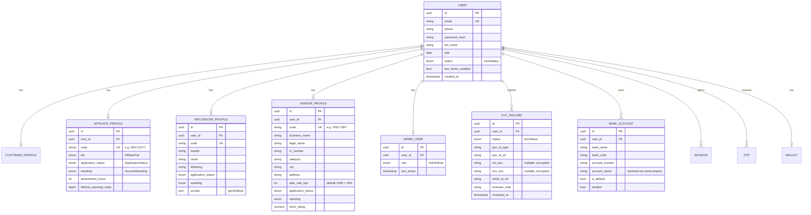
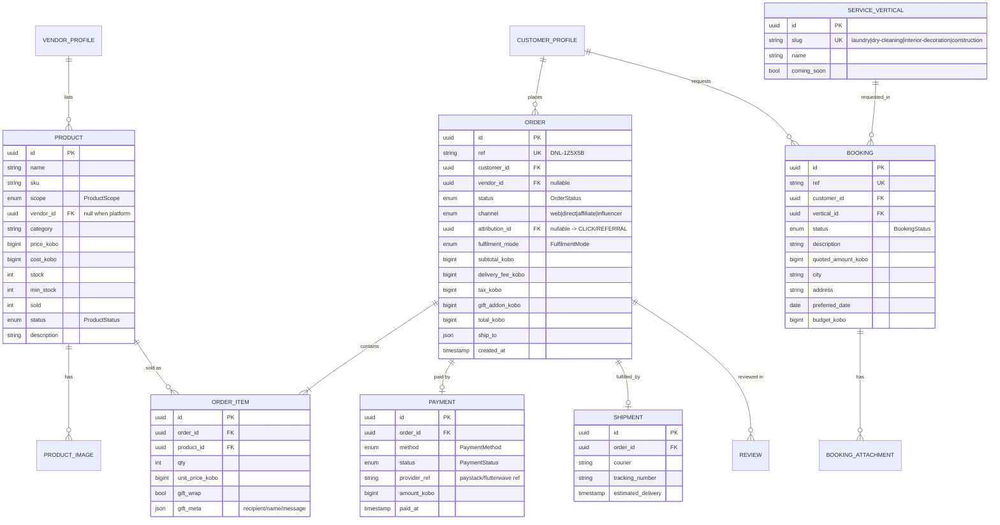
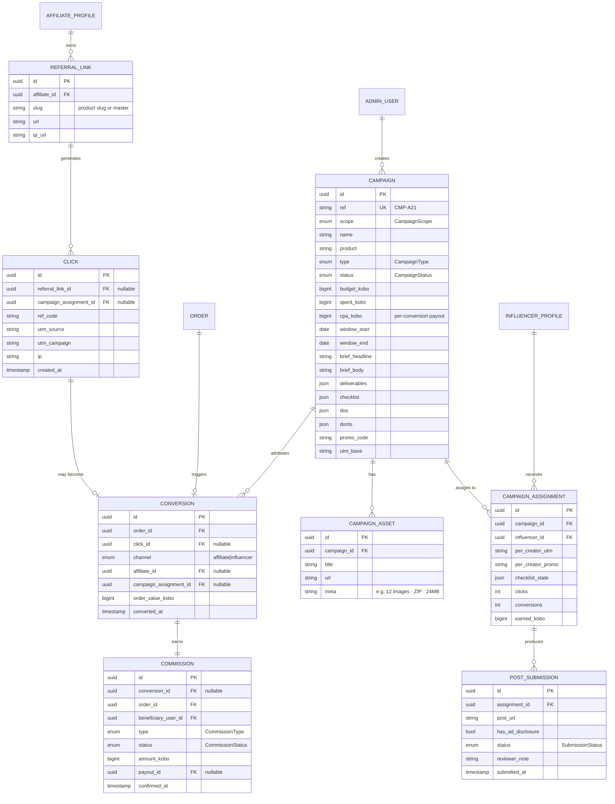
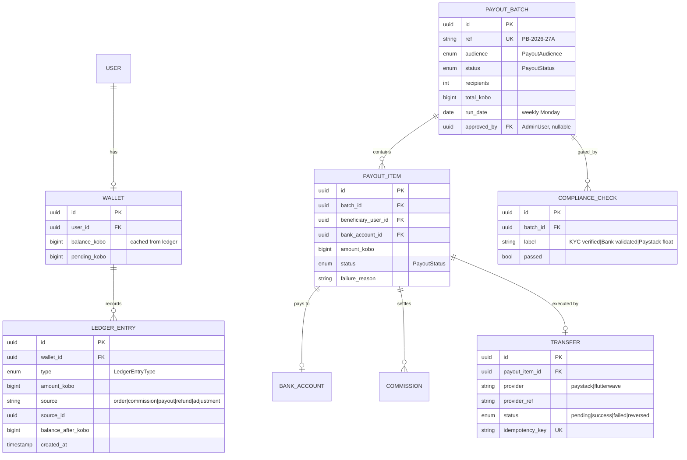
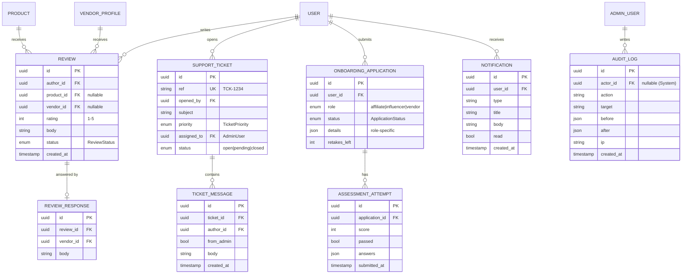

# Data Model & ERD

Source of truth for entities. Derived from the five frontends (`daniliya-web`,
`-affiliate`, `-influencer`, `-vendor`, `-admin`) and reconciled into one model.

> ⚠️ **This document is the target model. An earlier `prisma/schema.prisma`
> (555 lines) already exists in the repo and diverges from it** — see
> [Divergences from the current schema](#divergences) at the bottom. Reconcile
> per phase; do not assume the live schema matches this doc.

## Modeling decisions (reconciliations)

The frontends were built independently, so a few things are unified here:

1. **One `User`, many role profiles.** A person is a single `User` who may hold
   `Customer`, `Affiliate`, `Influencer`, `Vendor`, and/or `AdminUser` profiles.
   Codes like `DEX-GXY7` (affiliate/influencer) and `VND-71BT` (vendor) are
   per-profile referral/handle codes.
2. **Money is `Decimal(12,2)` naira** (Postgres `NUMERIC` — exact, *not* a float),
   matching the live schema. Prisma returns `Decimal` objects and the API
   serialises them as strings (`"50000.00"`); frontends format at the edge.
   **Never cast a money value to a JS `number` for arithmetic** — use
   `Prisma.Decimal`. (Decided 2026-07-16, superseding an earlier integer-kobo
   proposal: `NUMERIC` is already exact and avoids BigInt JSON pitfalls.)
3. **One `PayoutStatus`:** `scheduled | review | paid | failed` (+ `held`,
   `cancelled`). The admin command-centre `Queued` maps to `scheduled`.
4. **KYC uses Smile ID + bank name-enquiry, not NIN/BVN forms.** The live
   affiliate/vendor KYC forms collect a government ID upload + bank account
   (name auto-resolved). NIN/BVN appear only in stale display copy — the model
   keeps optional `nin`/`bvn` fields (encrypted) for Smile ID results but does
   not require them at submission.
5. **Commission lifecycle:** `pending → confirmed → disbursed`, with `reversed`
   on refund. This is the `Commission` entity's status.
6. **Attribution** is unified: a referral `?ref={code}` (affiliate) or a campaign
   UTM `utm_source=creator&utm_campaign={slug}&ref={code}` (influencer) creates a
   `Click`; a resulting order creates a `Conversion` → a `Commission`.
7. **Products** span two scopes: `platform` (digital, e.g. Daniliya Books) and
   `vendor` (marketplace). Moderation status is unified (see below).

## Enum reference (canonical)

| Enum | Values |
|---|---|
| `UserStatus` | `active` · `pending` · `suspended` |
| `Role` | `customer` · `affiliate` · `influencer` · `vendor` · `admin` |
| `AdminRole` (RBAC) | `superadmin` · `finance` · `support` · `user_manager` |
| `KycStatus` | `unverified` · `pending` · `verified` · `rejected` |
| `ApplicationStatus` | `pending` · `approved` · `rejected` (affiliate/influencer/vendor onboarding decision) |
| `AccountStanding` | `active` · `suspended` (separate axis from application decision) |
| `AffiliateTier` | `bronze` · `silver` · `gold` · `platinum` (loyalty rank by lifetime earnings — **not** a commission rate) |
| `ProductScope` | `platform` · `vendor` |
| `ProductStatus` | `draft` · `pending` · `published` · `rejected` · `out_of_stock` |
| `OrderStatus` | `new` · `confirmed` · `packed` · `shipped` · `delivered` · `cancelled` |
| `PaymentStatus` | `pending` · `paid` · `failed` · `refunded` |
| `PaymentMethod` | `paystack` · `flutterwave` · `pay_on_delivery` |
| `FulfilmentMode` | `delivery` · `pickup` |
| `BookingStatus` | `requested` · `confirmed` · `in_progress` · `completed` · `cancelled` |
| `CampaignScope` | `platform` · `vendor` |
| `CampaignType` | `cpa` · `hybrid` |
| `CampaignStatus` | `draft` · `scheduled` · `live` · `paused` · `ended` |
| `SubmissionStatus` | `submitted` · `approved` · `rejected` |
| `CommissionType` | `affiliate_flat` · `influencer_cpa` · `vendor_sale` |
| `CommissionStatus` | `pending` · `confirmed` · `disbursed` · `reversed` |
| `PayoutStatus` | `scheduled` · `review` · `held` · `paid` · `failed` · `cancelled` |
| `PayoutAudience` | `affiliate` · `influencer` · `vendor` |
| `ReviewStatus` | `published` · `flagged` · `removed` |
| `TicketPriority` | `low` · `normal` · `high` · `urgent` |
| `LedgerEntryType` | `debit` · `credit` |

## ERD — Identity, roles & KYC

## ERD — Catalog, orders & bookings

## ERD — Attribution, campaigns & submissions

## ERD — Money: wallet, ledger & payouts

## ERD — Reviews, support, onboarding & system

## Notes & open questions

- **Assessment content** (`AssessmentQuestion`) and **tutorial lessons** are
  affiliate-onboarding config — store as `AssessmentQuestion` / `TutorialLesson`
  reference tables (seeded), separate from user attempts.
- **`AffiliateTier`** thresholds (Bronze ₦0 / Silver ₦50k / Gold ₦250k /
  Platinum ₦1M) are lifetime-earnings ranks; recompute on commission
  confirmation. They gate perks only, never commission amount.
- **Review → product** currently joins by name in the vendor UI; here it's a
  real FK (`product_id`) with optional `vendor_id`.
- **Pricing config** (delivery ₦8,500, tax ₦2,500, gift +₦1,500, affiliate flat
  ₦10,000, min payout ₦5,000, vendor take-rate 10%) belongs in a `PlatformConfig`
  table so finance can tune without a deploy — see [Business rules](./04-business-rules.md).
- **Reconciliation**: `Transfer.provider_ref` + `Payment.provider_ref` are the
  join keys against Paystack/Flutterwave settlement reports.

## Divergences from the current schema 

`prisma/schema.prisma` (pre-existing, migrated as `init`) differs from this
target model. Each gap is a decision to make in the phase that needs it — the
Phase 1 auth work runs fine on the current schema as-is.

| Area | Current schema | This doc | Phase to resolve |
|---|---|---|--:|
| **Money** | `Decimal(12,2)` on Product/Order/Commission | integer **kobo** | P3/P6 |
| **Roles** | single `User.role` enum + optional profiles | multi-role profiles | P2 |
| **Affiliate commission** | `CommissionRule` with **rate** %s | **flat ₦10,000** (rates don't model it) | P5 |
| **Payout batch** | `PayoutBatchStatus { PENDING, DISBURSED }` | `scheduled→review→held→paid/failed` + compliance checks | P6 |
| **Wallet / ledger** | absent | double-entry `LEDGER_ENTRY` + `WALLET` | P6 |
| **Payments** | `Order.paymentRef` string only | `PAYMENT` + `TRANSFER` entities | P3/P6 |
| **KYC** | `KycSubmission` 1:1 **affiliate only**; `nin/bvnEncrypted` | per-user KYC; NIN/BVN optional (forms dropped them) | P2 |
| **Bank accounts** | `bankDetailsJson` string on profiles | `BANK_ACCOUNT` entity + name-enquiry | P2 |
| **Attribution** | `ClickEvent` (influencerCode only), no conversion | `CLICK` + `CONVERSION` for both channels | P5 |
| **Campaign status** | `ACTIVE/PAUSED/ENDED` | + `draft`, `scheduled` (admin UI has both) | P5 |
| **Product status** | `DRAFT/PENDING_REVIEW/ACTIVE/REJECTED/REMOVED` | + `out_of_stock` | P3 |
| **Order status** | `PENDING…PROCESSING…COMPLETED/REFUNDED` | vendor UI uses `packed`; no `completed` | P3 |
| **Bookings / Reviews / Support / Notifications / PlatformConfig** | absent (`QuoteRequest` only) | full entities | P4/P7 |
| **Shipments** | absent | `SHIPMENT` (courier, tracking) | P3 |
