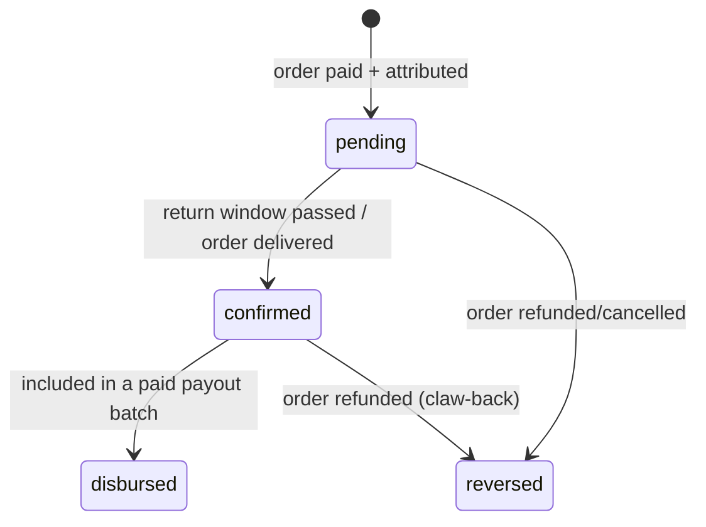

# Business Rules & Invariants

The financial and lifecycle logic. **Read before implementing anything that
touches money or status.** All amounts are **`Decimal(12,2)` naira** (Postgres
`NUMERIC` — exact, not a float). Never cast to a JS `number` for arithmetic; use
`Prisma.Decimal`.

## 1. Platform configuration

Defaults from the frontends. Lives in `src/config/pricing.ts` for now; moves to
a finance-tunable `PlatformConfig` table in Phase 7 (admin settings).

| Key | Default | Source |
|---|---|---|
| `AFFILIATE_COMMISSION` | **₦10,000** flat | affiliate `COMMISSION_PER_SALE` |
| `VENDOR_TAKE_RATE_PCT` | **10%** | vendor `commission = 10` |
| `DELIVERY_FEE` | **₦8,500** | web checkout |
| `TAX` | **₦2,500** | web checkout |
| `GIFT_ADDON` | **₦1,500** / item | web product buybox |
| `MIN_PAYOUT` | **₦5,000** | affiliate/influencer payouts |
| `payout_day` | **Monday** | all portals |
| `payout_time` | **09:00–10:00 WAT** | vendor 9am / affiliate 10am |
| `assessment_pass_pct` | **60** | affiliate assessment |
| `assessment_retakes` | **10** | affiliate assessment |
| `assessment_timer_sec` | **480** (8 min) | affiliate assessment |
| `tier_thresholds_kobo` | Bronze 0 · Silver 5,000,000 · Gold 25,000,000 · Platinum 100,000,000 | affiliate tiers |

## 2. Order total math

```
line_total      = Σ (item.unit_price_kobo × qty)
gift_addon       = gift_addon_kobo × (count of items with gift_wrap)
delivery_fee     = (mode == delivery) ? delivery_fee_kobo : 0
tax              = tax_kobo
order_total_kobo = line_total + gift_addon + delivery_fee + tax
```

- **Pickup** ⇒ no delivery fee. **Pay on Delivery** is allowed; **Pay Now** goes
  through Paystack/Flutterwave.
- Compute server-side in `POST /checkout/quote`; never trust client totals.

## 3. Commission rules

Three distinct commission types — do not conflate them.

### 3a. Affiliate — flat, not percentage
- **₦10,000 per confirmed qualifying sale**, regardless of order value.
  `affiliate_commission_kobo`. No tiers, no cap.
- Tiers (Bronze/Silver/Gold/Platinum) are **loyalty ranks** by *lifetime
  confirmed earnings* — they unlock perks only and **never** change the ₦10,000.

### 3b. Influencer — CPA per campaign
- `earned = conversions × campaign.cpa_kobo`. CPA rate is set per campaign by
  admin. `hybrid` campaigns may combine CPA + flat — model as CPA with an
  optional flat component on the assignment.
- A post is **payout-eligible only if** its submission is `approved` **and**
  carries the `#ad` disclosure.

### 3c. Vendor — platform take-rate
- Per order: `commission = round(subtotal × take_rate_bps / 10000)` (default 10%).
- `vendor_net = subtotal − commission`. Vendor payout aggregates net over the
  cycle. Take-rate is per-vendor (`VENDOR_PROFILE.take_rate_bps`).

## 4. Commission lifecycle



- A commission is created **`pending`** when a paid order is attributed.
- It becomes **`confirmed`** when the order clears its return/refund window (or
  is delivered) — only confirmed commissions are eligible for payout.
- **`disbursed`** once its payout item is `paid`.
- A **refund reverses** the commission (writes an offsetting ledger entry); if
  already disbursed, it becomes a claw-back against future earnings.

## 5. Attribution rules

- **Affiliate:** link carries `?ref={affiliate_code}`. A click records a
  `CLICK`; if an order is placed by that visitor within the **attribution window
  (default 30 days, last-click wins)**, a `CONVERSION` and a `pending`
  `COMMISSION` (₦10,000) are created for that affiliate.
- **Influencer:** UTM `utm_source=creator&utm_campaign={slug}&ref={creator_code}`
  or promo-code redemption maps to the `CAMPAIGN_ASSIGNMENT`; conversion earns
  `campaign.cpa_kobo`.
- **Codes are permanent** and tied to all historical referrals.
- An order has exactly one attribution `channel`: `affiliate | influencer |
  web | direct`. Ties resolve last-click; promo code overrides UTM if both present.

## 6. Payout run (weekly, Monday)

The **shared payout engine** serves affiliates, influencers, and vendors.

1. **Accrue** (during the week): confirmed commissions / vendor net amounts sit
   as `pending` wallet balance.
2. **Batch** (Monday): group eligible beneficiaries by `audience`
   (affiliate/influencer/vendor) into `PAYOUT_BATCH`es. A beneficiary is included
   only if: KYC `verified`, application `approved`, standing `active`, a
   `verified` default bank account, and accrued ≥ `min_payout_kobo` (₦5,000).
   Below-minimum balances roll to next week.
3. **Compliance gate** (`COMPLIANCE_CHECK`): *KYC verified on all recipients*,
   *bank accounts validated*, *sufficient Paystack float*. All must pass before
   a batch can leave `review`.
4. **Approve** (finance): `review → scheduled`. Executes transfers via
   Paystack/Flutterwave (idempotent, one `TRANSFER` per `PAYOUT_ITEM`).
5. **Settle:** transfer webhook → item `paid` (→ commission `disbursed`, ledger
   debit) or `failed`.
6. **Failures:** `retry failed transfers` re-executes only failed items; or
   `cancel`. Non-approved/unverified recipients are **excluded** (their history
   stays empty until approved).

Canonical statuses: `scheduled → review → (held) → paid | failed`, plus
`cancelled`. (Admin "Queued" == `scheduled`.)

## 7. Double-entry ledger invariants

- **Every** balance change is a `LEDGER_ENTRY`; wallet balance is derived, never
  set directly.
- Entries are **append-only** (no update/delete). Corrections are new offsetting
  entries.
- A payout debit must have a matching confirmed-commission credit lineage.
- Balances **never go negative** except via an explicit claw-back adjustment.

## 8. Idempotency

- Payment webhooks (Paystack/Flutterwave) and Smile ID callbacks are **retried
  by the provider** — handlers must be idempotent (dedupe on `provider_ref` /
  event id).
- Transfer creation uses an `idempotency_key` (one per payout item) so a retry
  never double-pays.
- `POST /orders` and `POST /payments/initialize` accept an `Idempotency-Key`
  header.

## 9. KYC gating

- KYC via **Smile ID** (government ID) + **bank name-enquiry** (account name must
  match). NIN/BVN optional (encrypted) — not required at submission.
- **Payouts are blocked** until KYC `verified`. Vendor go-live and affiliate
  activation also gate on approval.
- Affiliate onboarding auto-approves on assessment pass; **influencer & vendor
  require manual admin review** (`pending → approved | rejected`, ~24h SLA).

## 10. Assessment (affiliate onboarding)

- 10 questions, **8-minute** timer (auto-submits), **pass ≥ 60%**.
- **10 retakes**; each fail decrements `retakes_left` and resets answers.
- Pass ⇒ account activated, affiliate `code` + first pay-link issued.

## 11. Lifecycle state machines (summary)

Full diagrams in [06-flowcharts](./06-flowcharts.md). Canonical transitions:

| Entity | States |
|---|---|
| **Order** | `new → confirmed → packed → shipped → delivered`; any → `cancelled`; paid → refund |
| **Booking** | `requested → confirmed → in_progress → completed`; any → `cancelled` |
| **Product** | `draft → pending → published`; `pending → rejected`; `published ⇄ out_of_stock` |
| **Campaign** | `draft →` / `scheduled → live ⇄ paused → ended` (ended is terminal) |
| **Submission** | `submitted → approved | rejected` |
| **Payout batch** | `scheduled → review → (held) → paid | failed`; → `cancelled` |
| **Commission** | `pending → confirmed → disbursed`; → `reversed` |
| **Application** | `pending → approved | rejected` (rejected → resubmit) |

## 12. Audit <a name="audit"></a>

Every **money- or status-affecting write** emits an immutable `AUDIT_LOG`
entry: `{ actor_id (or System), action, target, before, after, ip, ts }`.
Examples that MUST audit: approve/reject (product, vendor, influencer, affiliate,
submission, KYC), release/hold/retry/cancel payout batch, refund/cancel order,
change tier, change take-rate, edit campaign budget, change RBAC role, remove review.

## 13. RBAC

| Role | Can |
|---|---|
| `superadmin` | Everything, incl. team/roles + PlatformConfig |
| `finance` | Payouts, finance, reconciliation, refunds |
| `support` | Support tickets, read-only people/orders |
| `user_manager` | People moderation (approve/suspend/tier) |

Ownership guards: affiliates/influencers/vendors can read/write **only their own**
records; enforced server-side, not by UI.
