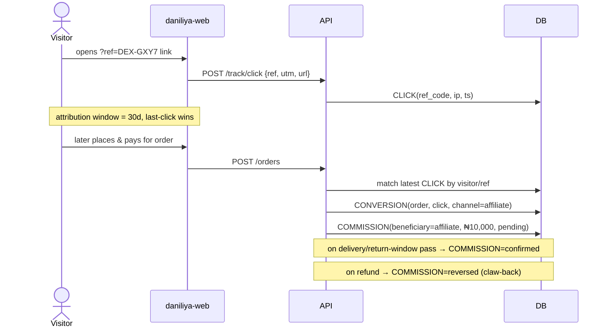
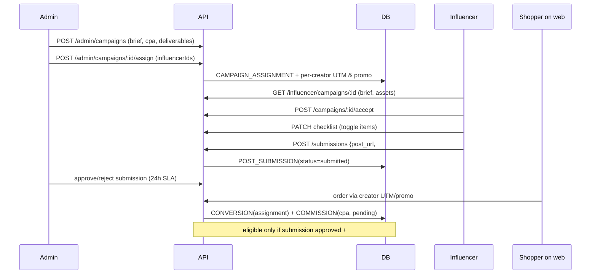
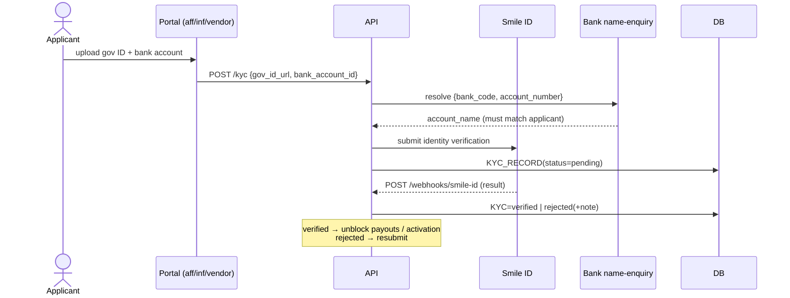
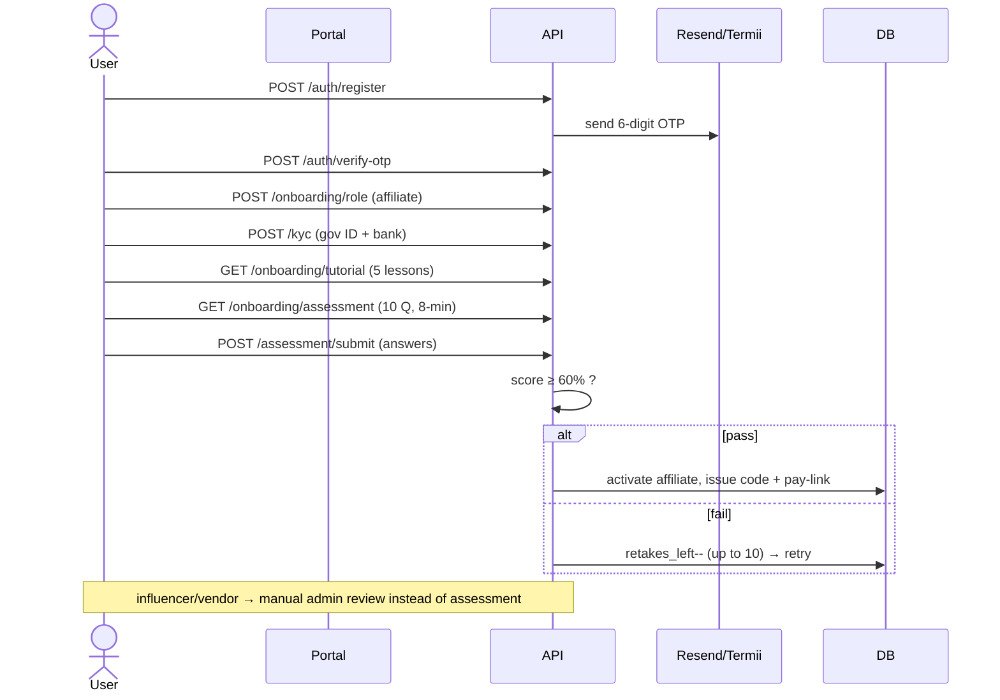

# Sequence Diagrams

End-to-end flows across clients, API, DB, and third parties. Mermaid renders on
GitHub.

## 1. Checkout & payment (Pay Now)

```mermaid
sequenceDiagram
    actor C as Customer
    participant WEB as daniliya-web
    participant API
    participant DB as Postgres
    participant PAY as Paystack/Flutterwave

    C->>WEB: Checkout (mode, contact, Pay Now)
    WEB->>API: POST /checkout/quote
    API->>API: compute subtotal+delivery+tax+gift (kobo)
    API-->>WEB: totals
    C->>WEB: Place order
    WEB->>API: POST /orders (Idempotency-Key)
    API->>DB: create ORDER(status=new), ORDER_ITEMs, PAYMENT(pending)
    API->>PAY: initialize transaction (amount, ref)
    PAY-->>API: authorization_url + provider_ref
    API-->>WEB: order.ref + payment URL
    C->>PAY: pays on hosted page
    PAY-->>API: POST /webhooks/paystack (signed, retried)
    API->>API: verify signature + dedupe provider_ref
    API->>DB: PAYMENT=paid, ORDER=confirmed
    API->>API: if attributed → CONVERSION + COMMISSION(pending)
    API->>DB: LEDGER credit (vendor net accrues)
    API-->>C: email receipt (Resend)
    Note over C,API: Pay-on-Delivery skips PAY; order=confirmed on placement
```

## 2. Affiliate attribution → commission



## 3. Influencer campaign — assign → post → convert



## 4. Weekly Monday payout run

```mermaid
sequenceDiagram
    participant CRON as Scheduler (Mon)
    participant API
    participant DB
    participant FIN as Finance admin
    participant RAIL as Paystack Transfers

    CRON->>API: trigger payout run
    API->>DB: select confirmed commissions / vendor net,<br/>filter KYC=verified, approved, active, ≥ ₦5,000
    API->>DB: create PAYOUT_BATCH per audience + PAYOUT_ITEMs
    API->>DB: run COMPLIANCE_CHECKs (KYC, bank, float)
    API-->>FIN: batches in status=review
    FIN->>API: POST /admin/payouts/:ref/approve
    API->>API: gate on all checks passed
    API->>DB: batch=scheduled
    loop each item
        API->>RAIL: transfer (idempotency_key)
    end
    RAIL-->>API: POST /webhooks/transfer (per item)
    API->>DB: item=paid → COMMISSION=disbursed, LEDGER debit
    Note over API,DB: failed items → retry or cancel; batch=paid when all settle
```

## 5. KYC verification (Smile ID)



## 6. Onboarding (affiliate path with assessment)



## 7. Vendor order fulfilment

```mermaid
sequenceDiagram
    actor VEN as Vendor
    participant VP as vendor portal
    participant API
    participant DB
    actor CUS as Customer

    Note over API,DB: order arrives status=new (payment=paid)
    VEN->>VP: open order
    VP->>API: POST /vendor/orders/:ref/advance (Confirm)
    API->>DB: status new→confirmed (audit)
    VEN->>API: advance → packed → shipped (tracking) → delivered
    API->>DB: each transition audited; SHIPMENT updated
    API-->>CUS: status notifications (Resend)
    Note over API,DB: on delivered → vendor net becomes confirmed for payout
```
