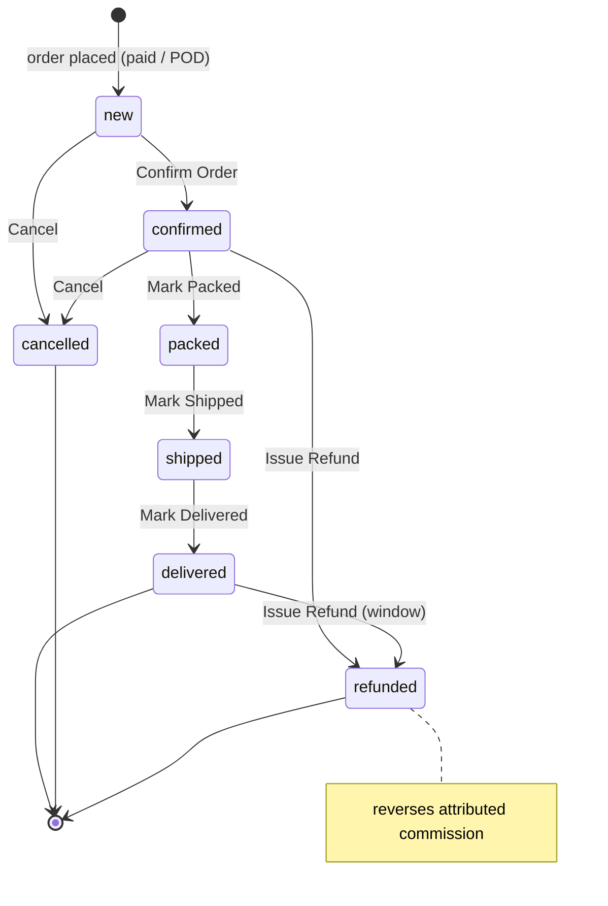
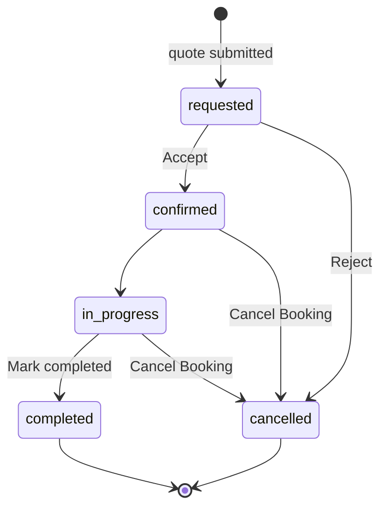
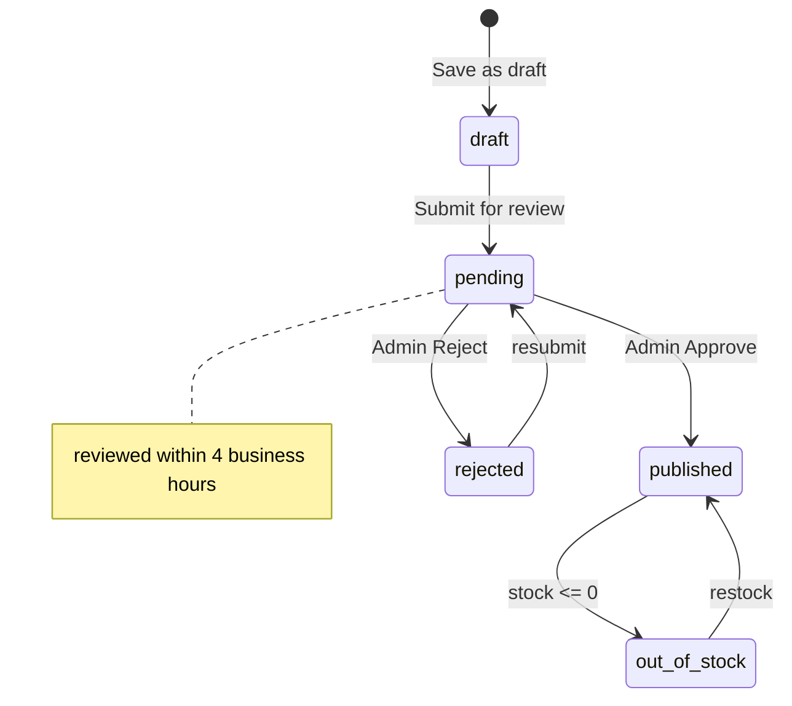
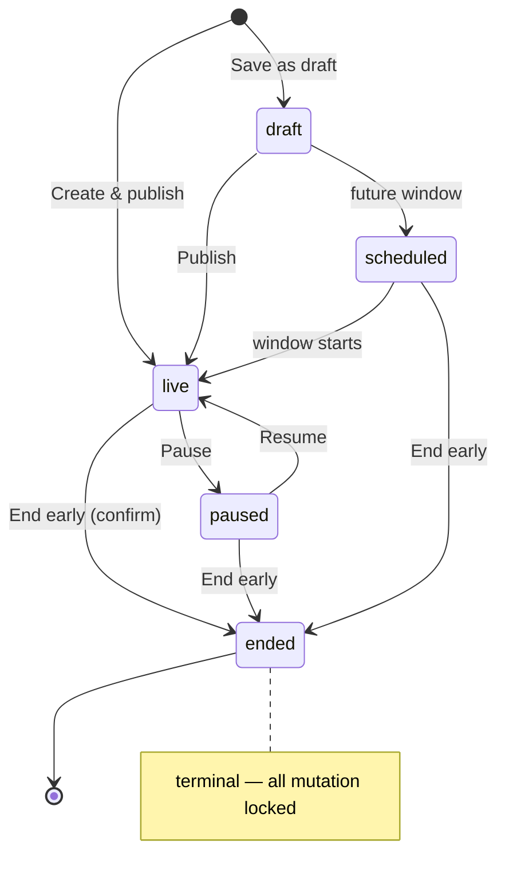
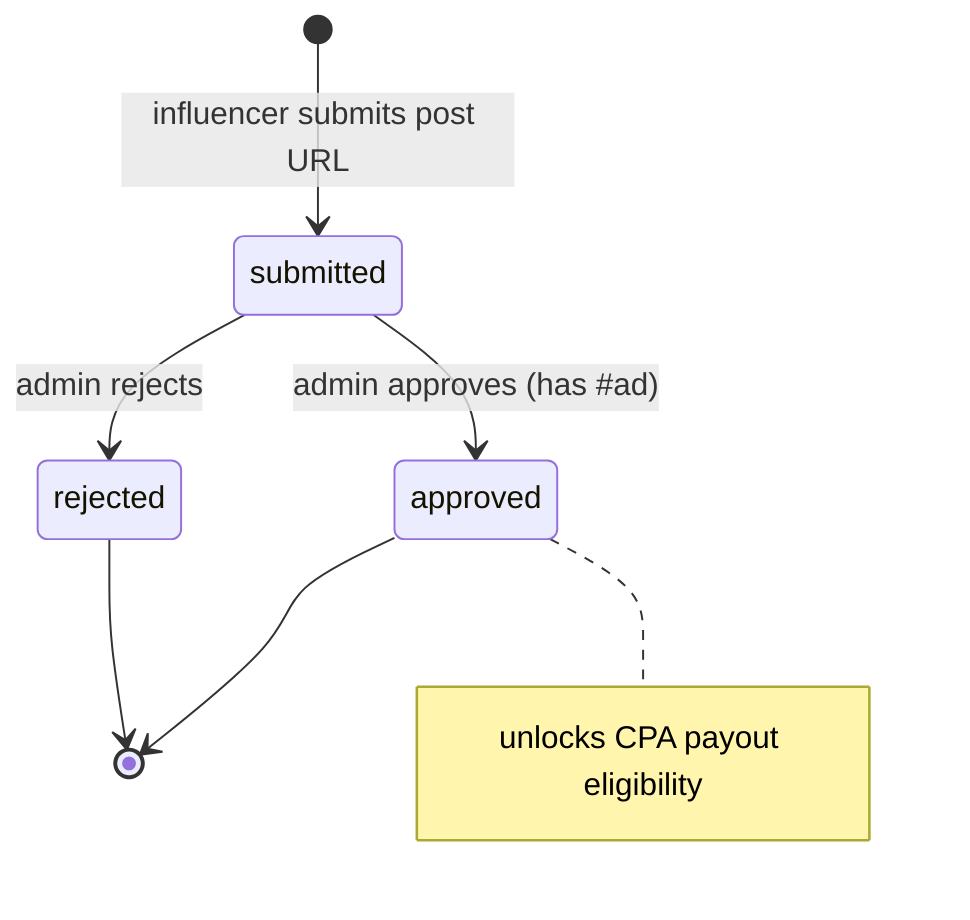
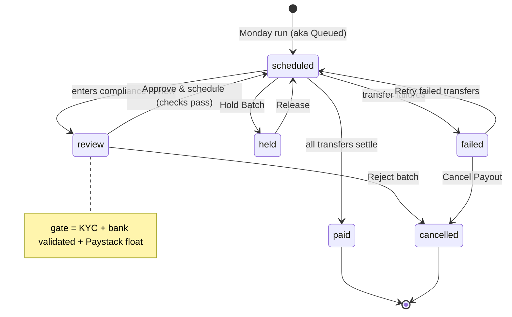
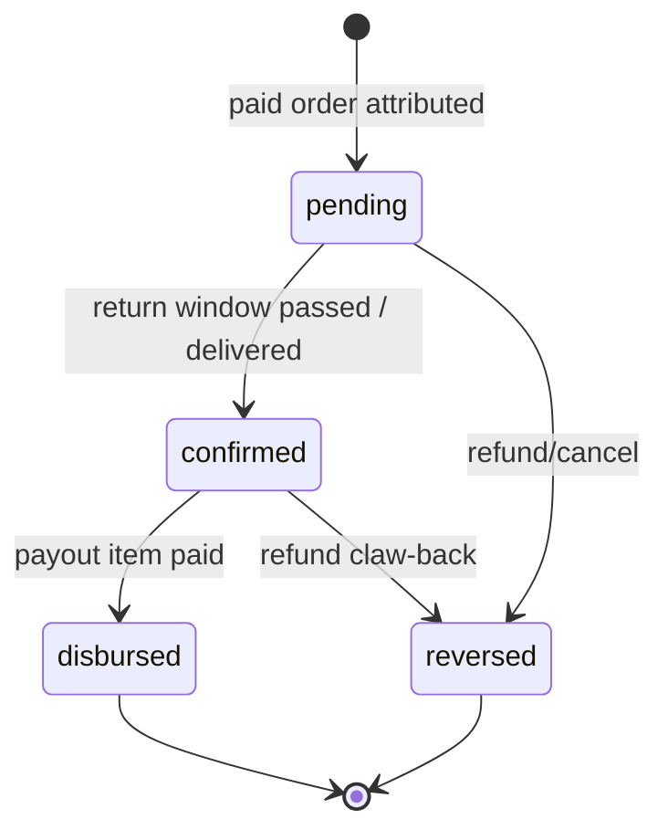
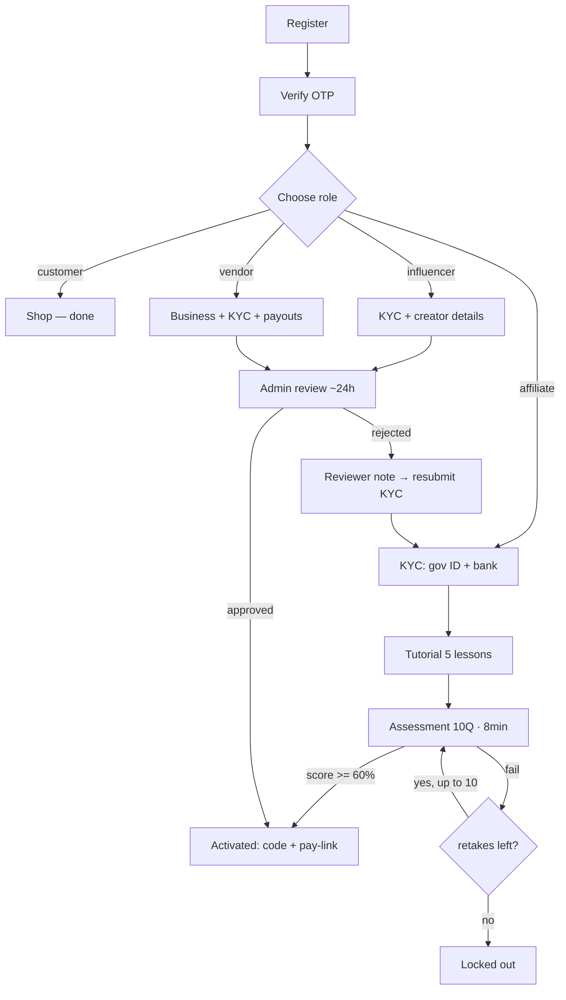
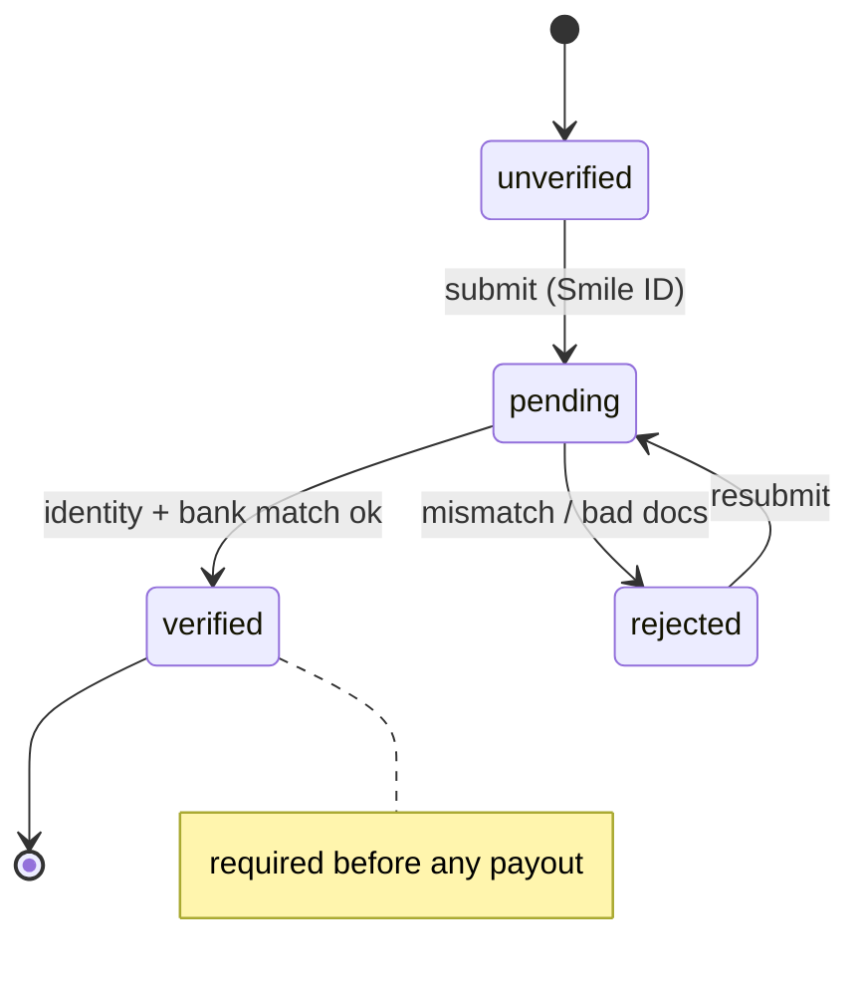
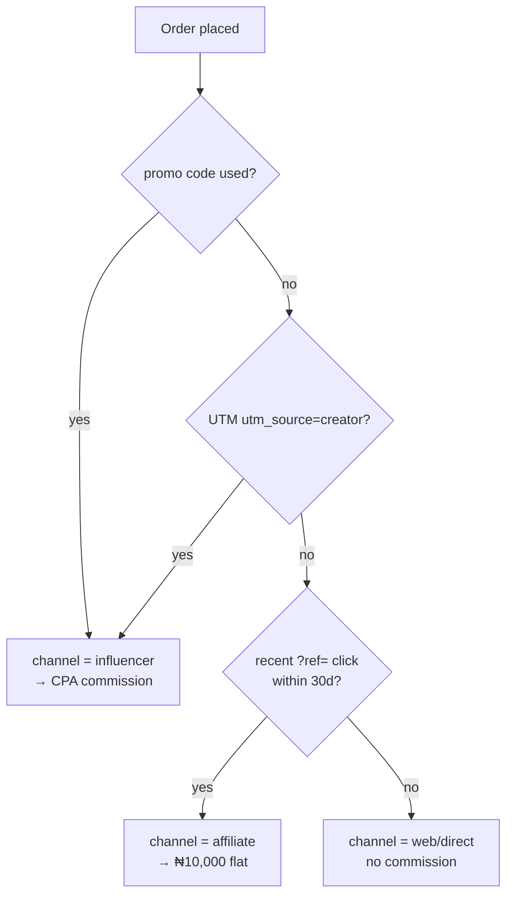

# Lifecycle Flowcharts & State Machines

Canonical state machines for every stateful entity. Transitions map 1:1 to the
endpoints in [03-endpoints](./03-endpoints.md) and the rules in
[04-business-rules](./04-business-rules.md).

## Order

## Booking (services)

## Product moderation

## Campaign

## Post submission

## Payout batch

## Commission

## Onboarding application + KYC

## KYC record

## Attribution channel resolution (per order)

