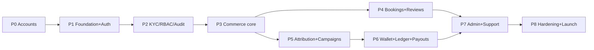

# Backend Delivery Plan

Module breakdown + phased build plan for `daniliya-api`. Phase 0 stands up every
account/credential the API depends on (starting from Gmail); Phases 1–8 build the
backend feature-by-feature on top of the [architecture](./01-architecture.md),
[data model](./02-data-model.md), [endpoints](./03-endpoints.md), and
[business rules](./04-business-rules.md).

## How to read this plan

- **Hat labels** mark who owns each item: 🎩`[Ops]` accounts/business, `[DevOps]`
  infra/CI, `[Backend]` app code, `[Integrations]` 3rd-party wiring, `[Data]`
  schema/migrations, `[QA]` testing, `[Security]` hardening.
- **QA gate** = a milestone doesn't close until its exit criteria pass. No phase
  starts before its dependencies are green.
- Durations are working-week estimates for a 1–2 engineer backend team; they slot
  into the overall 28-week programme alongside frontend integration.
- Money is kobo; every financial phase ships with tests before it's "done".

## Module inventory

Grouped as they'll become NestJS modules (see [architecture §4](./01-architecture.md)):

| Group | Modules |
|---|---|
| **Spine (shared)** | Config · Auth · Users/Profiles · KYC · BankAccounts · Media · Notifications · RBAC/AdminUsers · AuditLog |
| **Money** | Wallet · Ledger · Payments · Payouts · Finance/Reconciliation · Commission |
| **Commerce** | Products/Catalog · Cart · Orders · Shipments · Bookings/Services · Reviews |
| **Growth** | ReferralLinks · Attribution (clicks/conversions) · Campaigns · Assignments · Submissions · Referrals/Leaderboard |
| **Back office** | Onboarding/Assessment · Admin-Moderation · Support |
| **Platform** | Health · Webhooks · Jobs/Scheduler · PlatformConfig |

---

## Phase 0 — Accounts, business & access setup

**Goal:** every credential in `.env.example` is real and working (test mode where
applicable) before a line of feature code depends on it. Do this in dependency
order — later accounts need earlier ones.

> 📋 **Printable version:** [Phase 0 account-setup checklist](./phase-0-account-setup-checklist.md)
> — tickable boxes, signup links, DNS records, `.env` tracker, and KYB documents list.

> ⚠️ **Prerequisite that gates the money providers:** Nigerian **business
> registration (CAC/RC number)** + a business bank account. Paystack, Flutterwave,
> and Smile ID require business verification (KYB) for **live** keys and
> settlement — this can take days to weeks, so **start it on day 1** even though
> you can build against **test** keys immediately.

### 0.1 Identity & domain foundation 🎩`[Ops]`
| # | Account | Why | Depends on | Done when |
|---|---|---|---|---|
| 1 | **Gmail / Google Workspace** (company inbox, e.g. `ops@daniliya.com`) | The root identity used to register every other service + shared recovery inbox. Use a **shared/role inbox**, not a personal Gmail, so account recovery survives staff changes. | — | Company Google account live; 2FA on; recovery set |
| 2 | **Domain + DNS** (`daniliya.com`) access | Needed for email sender auth (SPF/DKIM), webhooks, API subdomain, portal domains | Google acct | You can add DNS records |
| 3 | **Google Workspace email on domain** | Branded `@daniliya.com` addresses; also the "from" identity | Domain DNS | MX + branded mailboxes work |
| 4 | **Password manager / shared vault** (1Password/Bitwarden) | Store all provider secrets; never in Git | Google acct | Team vault created |

### 0.2 Source, hosting & data 🎩`[DevOps]`
| # | Account | Why | Env keys unlocked |
|---|---|---|---|
| 5 | **GitHub org** (`Devstrike-DigTech`) | Repos, CI/CD, secrets, environments | — |
| 6 | **API hosting** (Render / Railway / AWS ECS / Fly) | Deploy the NestJS API (Docker) | `PORT`, `NODE_ENV`, `CORS_ORIGIN` |
| 7 | **Managed PostgreSQL** (Neon / Supabase / RDS) | Primary DB | `DATABASE_URL` |
| 8 | **Managed Redis** (Upstash / Elasticache) | Cache, sessions, BullMQ queues | `REDIS_URL` |
| 9 | **AWS account** (IAM user + S3 bucket) | Media/object storage | `AWS_ACCESS_KEY_ID`, `AWS_SECRET_ACCESS_KEY`, `AWS_REGION` |
| 10 | **Cloudinary** | Image transforms/CDN for product & creative media | `CLOUDINARY_CLOUD_NAME`, `CLOUDINARY_API_KEY`, `CLOUDINARY_API_SECRET` |

### 0.3 Payments & identity (KYB-gated) 🎩`[Ops]`+`[Integrations]`
| # | Account | Why | Notes | Env keys |
|---|---|---|---|---|
| 11 | **Paystack** (business) | Card/bank collection **and** Transfers (payouts) | Test keys instantly; live needs CAC + settlement bank. Enable **Transfers** for the payout engine. | `PAYSTACK_SECRET_KEY`, `PAYSTACK_PUBLIC_KEY` |
| 12 | **Flutterwave** (business) | Secondary/fallback payment rail | Same KYB gate; used for redundancy | `FLUTTERWAVE_SECRET_KEY`, `FLUTTERWAVE_SECRET_HASH` |
| 13 | **Smile ID** | KYC identity verification | KYB onboarding; start in **sandbox** | `SMILE_ID_PARTNER_ID`, `SMILE_ID_API_KEY`, `SMILE_ID_ENVIRONMENT` |

### 0.4 Communications 🎩`[Integrations]`
| # | Account | Why | Notes | Env keys |
|---|---|---|---|---|
| 14 | **Resend** | Transactional email (OTP, receipts, notices) | Verify `daniliya.com` sending domain (SPF/DKIM DNS) | `RESEND_API_KEY`, `RESEND_FROM_EMAIL`, `RESEND_FROM_NAME` |
| 15 | **Termii** | SMS / OTP (Nigeria) | **Sender ID approval takes days** (DND rules) — request early | `TERMII_API_KEY`, `TERMII_SENDER_ID` |

### 0.5 Observability & bootstrap 🎩`[DevOps]`
| # | Account | Why | Env keys |
|---|---|---|---|
| 16 | **Sentry** | Error/perf monitoring | `SENTRY_DSN` |
| 17 | Generate `JWT_ACCESS_SECRET`, `JWT_REFRESH_SECRET`, `ENCRYPTION_KEY` | Auth + field encryption | those keys |
| 18 | Set `ADMIN_EMAIL` (seed superadmin) | First admin login | `ADMIN_EMAIL` |

**QA gate 0:** a `/health` deploy reads every env var; a smoke test hits Paystack
test-init, Resend test-send, Termii test-SMS, Smile sandbox, S3/Cloudinary upload,
DB + Redis ping — all green. **Live (KYB) approvals tracked separately**; test
mode is enough to unblock Phases 1–7.

---

## Phase 1 — Platform foundation & Auth  ·  ~2 wks

**Goal:** a deployable API skeleton + working authentication.

- 🎩`[DevOps]` Repo bootstrap: Nest modules, config module (typed env), Docker,
  `docker-compose` (Postgres+Redis), CI (lint/test/build), staging deploy.
- 🎩`[Backend]` Global concerns: validation pipe (class-validator), error filter
  (problem shape), request logging, Sentry, Swagger/OpenAPI, health checks.
- 🎩`[Data]` ORM + migration setup; base entities; seed script (superadmin from
  `ADMIN_EMAIL`).
- 🎩`[Backend]` **Auth module:** register → OTP (Resend/Termii) → verify → login
  → JWT access+refresh (rotation, Redis revocation) → refresh, logout, password
  reset, change password, 2FA scaffold, sessions.
- 🎩`[Backend]` Users/Profiles (read/update `/me`), Media signed-upload,
  Notifications skeleton.

**Dependencies:** Phase 0.1, 0.2, 0.4, 0.5. **QA gate 1:** full auth flow e2e
(register→verify→login→refresh→reset); OpenAPI published; CI green on deploy.

## Phase 2 — Identity, KYC, RBAC & Audit  ·  ~2 wks

**Goal:** verified identities and the admin trust backbone.

- 🎩`[Integrations]` **KYC module** (Smile ID sandbox) + `/webhooks/smile-id`
  (idempotent, signed).
- 🎩`[Backend]` **BankAccounts** + `/banks/resolve` name-enquiry (Paystack).
- 🎩`[Backend]` **RBAC** (roles/guards) + **AuditLog** (interceptor that records
  money/status writes) — built now because every later admin action audits.
- 🎩`[Backend]` **Onboarding/Assessment**: applications, tutorial/assessment
  engine (60% pass, 10 retakes, 8-min timer), role provisioning.

**Dependencies:** Phase 1, 0.3. **QA gate 2:** KYC sandbox verify→approve gates a
flag; assessment scoring correct; every privileged write appears in audit log.

## Phase 3 — Catalog & Commerce core  ·  ~3 wks

**Goal:** browse → buy → pay → fulfil.

- 🎩`[Backend]` **Products/Catalog** (platform + vendor scope, moderation states),
  vendor product CRUD + submit-for-review.
- 🎩`[Backend]` **Cart** + **Checkout quote** (server-side kobo math: subtotal +
  delivery/pickup + tax + gift add-on).
- 🎩`[Backend]` **Orders** + **Shipments** + fulfilment state machine + public
  `/orders/track`.
- 🎩`[Integrations]` **Payments**: Paystack/Flutterwave init + `/webhooks/*`
  (idempotent, signed) → order paid → fulfilment; Pay-on-Delivery path.

**Dependencies:** Phase 1–2, 0.3. **QA gate 3:** end-to-end order (Pay Now +
POD) with webhook confirmation; totals exact to the kobo; refund path stubbed.

## Phase 4 — Services/Bookings & Reviews  ·  ~1.5 wks

- 🎩`[Backend]` **Service verticals** + **Bookings/quotes** (attachments via
  Media) + booking lifecycle.
- 🎩`[Backend]` **Reviews** (product/vendor) + vendor response + admin moderation
  (published/flagged/removed).

**Dependencies:** Phase 3. **QA gate 4:** quote→accept→complete flow; review
moderation transitions audited.

## Phase 5 — Growth: attribution & campaigns  ·  ~3 wks

**Goal:** referrals and creator campaigns that generate (pending) commissions.

- 🎩`[Backend]` **ReferralLinks** (+ QR) & **Attribution**: click tracking,
  conversion matching (30-day last-click; promo/UTM override), channel resolution.
- 🎩`[Backend]` **Commission engine**: create `pending` commissions — affiliate
  flat ₦10k, influencer CPA, vendor net — with the `pending→confirmed→disbursed→reversed`
  lifecycle.
- 🎩`[Backend]` **Campaigns** (admin CRUD + lifecycle) → **Assignments**
  (per-creator UTM/promo) → **Submissions** (review, #ad gate).
- 🎩`[Backend]` **Referrals/Leaderboard** + affiliate tier recompute.

**Dependencies:** Phase 3 (orders). **QA gate 5:** a paid attributed order
produces the correct commission of the correct type/amount; refund reverses it.

## Phase 6 — Money: wallet, ledger & payouts  ·  ~3 wks

**Goal:** the weekly Monday payout engine, end to end.

- 🎩`[Data]` **Double-entry Ledger** + **Wallet** (derived balances, append-only,
  no negatives).
- 🎩`[Backend]` **Payouts**: weekly cron batching by audience, eligibility
  filter (KYC/approved/active/≥₦5,000), **compliance checks**, batch lifecycle.
- 🎩`[Integrations]` **Transfers** (Paystack) with idempotency keys +
  `/webhooks/transfer` → item paid/failed → commission disbursed; retry/cancel.
- 🎩`[Backend]` **Finance/Reconciliation** metrics + ledger-vs-settlement report.

**Dependencies:** Phase 5 (commissions), 0.3 (Paystack Transfers). **QA gate 6:**
a full batch runs in sandbox — accrue → batch → compliance → approve → transfer →
webhook settle → ledger balances reconcile to zero drift; retry works; **no
double-pay** under webhook replay.

## Phase 7 — Admin surfaces & Support  ·  ~2 wks

- 🎩`[Backend]` Admin moderation endpoints (people approve/reject/suspend/tier;
  orders refund/cancel; products/bookings/reviews moderation) — wiring the state
  machines to RBAC + audit.
- 🎩`[Backend]` **Command centre** aggregates, **Finance** dashboards, **Support**
  tickets, **Team/RBAC invite**, **PlatformConfig** (tunable fees/min-payout/take-rate),
  notification settings.

**Dependencies:** Phases 2–6. **QA gate 7:** every admin action in the
[UI map](./07-ui-endpoint-map.md) has a working, authorized, audited endpoint.

## Phase 8 — Hardening, launch & go-live  ·  ~2 wks

- 🎩`[Security]` Security review (authz coverage, rate limiting, input fuzzing,
  secret hygiene, webhook signature enforcement), NDPA data-handling review.
- 🎩`[QA]` Load/concurrency tests on checkout, webhooks, payout batches;
  idempotency soak tests.
- 🎩`[DevOps]` Prod env, **live** Paystack/Flutterwave/Smile keys (KYB approved),
  Termii sender ID live, backups, alerting, runbooks.
- 🎩`[Ops]` UAT with each portal; reconciliation dry-run against real settlement.

**QA gate 8 (launch):** UAT sign-off per portal; live payment + live payout
smoke test reconciles; monitoring/alerting live; rollback plan documented.

---

## Milestones & sequencing

## Indicative timeline (backend track)

```mermaid
gantt
    dateFormat  X
    axisFormat  wk%s
    section Setup
    P0 Accounts (start day 1, KYB in parallel) :0, 2
    section Build
    P1 Foundation + Auth      :2, 2
    P2 KYC / RBAC / Audit     :4, 2
    P3 Commerce core          :6, 3
    P4 Bookings + Reviews     :9, 2
    P5 Attribution + Campaigns:9, 3
    P6 Wallet + Payouts       :12, 3
    P7 Admin + Support        :15, 2
    section Launch
    P8 Hardening + Launch     :17, 2
```

≈ **19 weeks** of backend work (P4 & P5 overlap). P0 account KYB approvals run in
parallel from day 1. This fits inside the 28-week programme with frontend
integration and buffer.

## Cross-cutting workstreams (run every phase)

- 🎩`[QA]` Tests written **with** each feature (unit + e2e); financial code is
  test-first. Milestone QA gates are hard stops.
- 🎩`[DevOps]` CI/CD, migrations reviewed, staging always deployable.
- 🎩`[Security]` Idempotency + signature verification on every webhook; audit on
  every privileged write; secrets only in the vault.
- 🎩`[Ops]` Track KYB/sender-ID approvals as a parallel checklist — they gate
  **live** launch (Phase 8), not development.

## Top risks & how the plan handles them

| Risk | Mitigation |
|---|---|
| KYB (Paystack/Flutterwave/Smile) approval delays | Start CAC + applications day 1; build entirely on test/sandbox keys through P7 |
| Termii sender-ID approval lag | Request in P0; fall back to email OTP (Resend) until approved |
| Double-pay / webhook replay | Idempotency keys + signature verify baked into P3 & P6; soak-tested in P8 |
| Money bugs | Kobo integers + double-entry ledger + test-first financial phases + reconciliation gate |
| Scope creep across 5 portals | Feature-by-feature phases mapped to the [UI→endpoint map](./07-ui-endpoint-map.md); nothing built that no screen calls |
